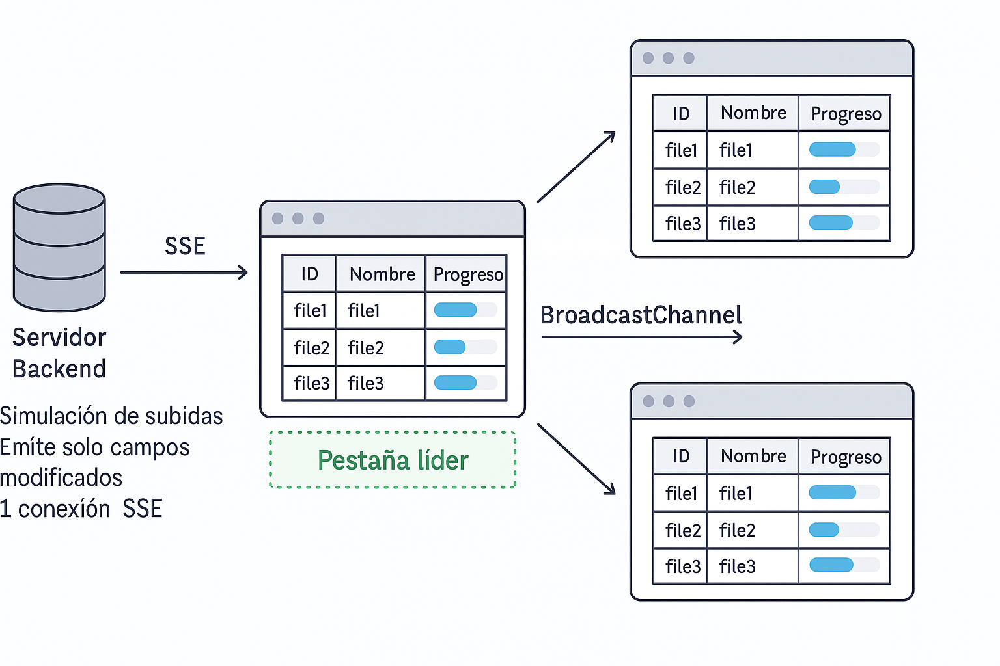

# Simulación de Subidas con SSE y Coordinación entre Pestañas

Este proyecto simula un sistema de subidas de archivos en tiempo real utilizando **Server-Sent Events (SSE)** y **Vue 3** en el frontend. Solo una pestaña mantiene la conexión SSE activa (la "líder"), y comparte los cambios con el resto de pestañas abiertas usando `BroadcastChannel`.

---

## 🚀 Tecnologías utilizadas

- 🟢 Node.js + Express (backend)
- 🟣 Vue 3 + Composition API (frontend)
- 🟡 Server-Sent Events (SSE)
- 📡 BroadcastChannel API (coordinación entre pestañas)

---

## 🧠 ¿Qué demuestra?

- Cómo compartir una única conexión SSE entre múltiples pestañas.
- Coordinación automática: si la pestaña líder se cierra, otra toma el control.
- Simulación realista de archivos que se suben con cambios progresivos.
- Optimización de red:
  - Solo se envían los **campos que cambian** (progreso, URL, fecha…), evitando enviar datos redundantes.
  - **Solo una pestaña mantiene la conexión SSE** con el backend, reduciendo la carga del servidor.
  - Las demás pestañas reciben actualizaciones a través de `BroadcastChannel`, sin duplicar conexiones.

---

## 🛠 Instalación y ejecución

```bash
git clone https://github.com/ivanmasogo/sse-uploads-demo.git
cd sse-uploads-demo

cd backend
npm install
node index.js

cd ../frontend
npm install
npm run dev
``` 

## 🧪 Cómo probar la sincronización entre pestañas

Este proyecto implementa una arquitectura inteligente para minimizar las conexiones al servidor y compartir estado en tiempo real entre pestañas.

### Pasos para probarlo:

1. **Abre** [http://localhost:5173](http://localhost:5173) en una pestaña del navegador.
2. **Abre varias pestañas más** con la misma URL.
3. Verás que **todas muestran la misma cola de subidas** sincronizada.
4. Solo **una pestaña (la líder)** se conecta al backend mediante **SSE**.
5. Las demás reciben actualizaciones de la líder a través de `BroadcastChannel`.
6. Si cierras la pestaña líder:
   - Automáticamente **otra pestaña toma el control** y se convierte en la nueva líder.
   - Se reconecta al backend por SSE y continúa la sincronización sin interrupciones.

### 🔍 Cómo saber qué pestaña es la líder

- Abre la consola del navegador (`F12 → Console`).
- Si una pestaña es líder, verás un mensaje como:
  ```bash
  ✅ Esta pestaña es la líder. Conectada al backend vía SSE.
  ```
- Si una pestaña no es líder, mostrará:
  ```bash
  📡 Esta pestaña no es la líder, escucha desde BroadcastChannel.
  ```
  y podrás ver los datos recibidos con trazas console.log como: 
  ```bash
  [NO líder] Recibido update: [...]
  ```
- Cuando una pestaña toma el liderazgo tras cerrarse la anterior, mostrará:
  ```bash
  [INFO] El líder se ha cerrado. Esta pestaña tomará el control.
  ✅ Esta pestaña es la líder. Conectada al backend vía SSE.
  ```
## 🧱 Arquitectura del sistema
<p align="center">
  
</p>
